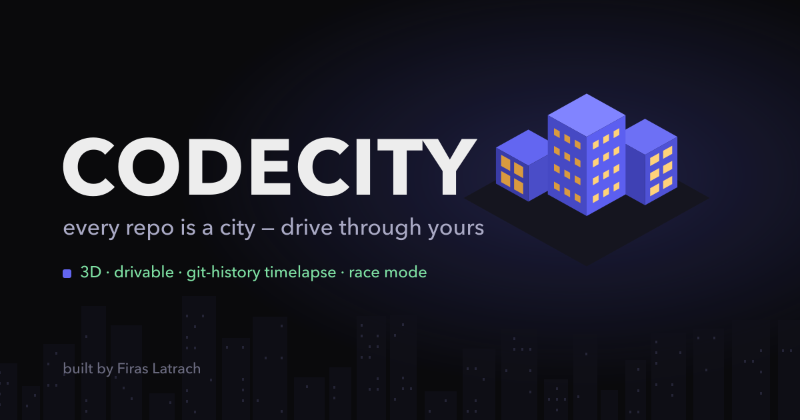

<p align="center"></p>

# 🏙️ CodeCity

**Every repo is a city. Drive through yours.** — [**drive it live →**](https://codecity-3d.vercel.app/)

CodeCity turns any GitHub repository into a drivable 3D night city — then hands you the keys.

- **Building = file** — height grows with lines of code, footprint with size
- **District = folder** — the repo's tree becomes the street plan (squarified treemap)
- **Glowing windows = hot files** — the most-committed files light up the skyline
- **Faces in the sky** — the repo's top contributors greet you at the gate (real GitHub avatars), and the busiest files fly their top author's face overhead

> Paste a GitHub URL, wait a few seconds, drive.

<!-- Press P in your city and drop the share card here -->
<!--  -->

## ✨ What's inside

| | |
|---|---|
| 🚗 **Three cars** | coupe, racer, truck — each with its own handling and a fully synthesized engine voice (Web Audio gearbox, zero audio files) |
| 🕰️ **Git timelapse** | press **T** — the camera orbits while the city rebuilds itself commit by commit, activity-weighted so busy months get their moment |
| 🏁 **Race mode** | press **R** — 3-2-1-GO through 8 glowing checkpoint gates, best time saved per repo |
| 🪙 **Coin run** | press **G** — collect every coin, 5 hearts, crashing into a building costs one |
| 📸 **Share card** | press **P** — a cinematic 1600×900 PNG + an 8-second WebM clip of your city growing from nothing |
| 🤖 **AI landmarks** | optional: an LLM reads the repo's stats and crowns 4–6 buildings with golden monument signs + a city motto |
| 📖 **Read in-city** | drive up to any building and press **E** to open the file right there |

Everything runs on exactly **two dependencies**: [three.js](https://threejs.org) and [vite](https://vitejs.dev).

## 🚀 Quick start

```bash
git clone https://github.com/FirasLatrech/CodeCity
cd CodeCity
npm install
npm run dev        # → http://localhost:8137
```

Paste any public GitHub repo URL on the landing page. The server fetches it **without a full clone** — the tree streams in as a tarball while a blob-less bare clone brings commit history (metadata only, no file contents; usually 5–15% of a real clone) — then analyzes everything and drops you at the city gate at `/<repo-name>`.

Already have the repo locally? Skip the clone:

```bash
node analyze.mjs /path/to/repo    # bakes public/cities/<name>.json
# then open http://localhost:8137/<name>
```

### Optional: AI city planner

```bash
echo 'GROQ_API_KEY=your_key' > .env.local
```

With a (free) [Groq](https://groq.com) key set, each analyzed city gets AI-picked landmarks and a motto. The key never leaves the server. No key → the city simply has no monuments.

### Deploying it publicly

If you host CodeCity for others, set two things in `.env.local`:

```bash
GITHUB_TOKEN=ghp_...   # lifts the GitHub API limit from 60 to 5000 req/h (analyzes/hour)
GROQ_API_KEY=...       # optional, as above
```

Built-in scale guards handle the rest: identical concurrent requests share one build, at most 4 repos analyze at once (extras get a "try again" 503), the analyzer runs in a child process so a huge repo never freezes other visitors, and the on-disk clone cache is capped at 40 repos (oldest evicted — the baked cities stay). For serious traffic, front it with a real job queue and a CDN on `/cities/*.json`.

## 🎮 Controls

| Key | Action |
|-----|--------|
| **W A S D** / arrows | drive |
| **Shift** | boost |
| **C** | change car |
| **E** | read the nearest file |
| **T** | git-history timelapse |
| **R** | race mode |
| **G** | coin run |
| **P** | share card + clip |
| **M** | mute |

## 🧠 How it works

Two strictly separated halves:

1. **The analyzer** (`analyze.mjs`, stdlib-only Node) walks the tree, counts lines with a single byte-scan, runs one pass of `git log` for per-file commits / age / authors, resolves avatars (GitHub noreply → avatar URL, others → gravatar, with a GitHub API fallback for work emails), computes the squarified treemap layout, and bakes it all into one `city.json`.
2. **The renderer** (`src/`, three.js) never touches git or the filesystem — it just draws the baked JSON. Buildings and plates are instanced meshes, the city's shadow map is baked once, and quality auto-scales (resolution → MSAA → bloom) to hold the frame rate.

Big repos stay fast by design: only the ~3,500 biggest files are kept, history parsing caps at 50k commits, and cities over 1,500 buildings skip the AI call. True giants (linux is 6 GB of git) also skip the history download — the tarball alone builds the city in about a minute; those cities just have no commit glow or timelapse (clone locally and run `node analyze.mjs` if you want a monster *with* history).

```bash
node analyze.mjs --check   # analyzer self-test
```

## 🤝 Contributing

PRs welcome! The ground rules live in [CLAUDE.md](CLAUDE.md) — the short version:

- buildings are **always** `InstancedMesh`, layout math stays in the analyzer, thresholds are percentiles (never absolute), and no new dependencies for anything a few lines can do
- a new car is one entry in `CARS` (`src/car.js`) — body, handling spec, engine profile — and nothing else

## 📄 License

[MIT](LICENSE)

---

Built by [Firas Latrach](https://github.com/FirasLatrech) · inspired by every codebase that deserved to be a skyline
